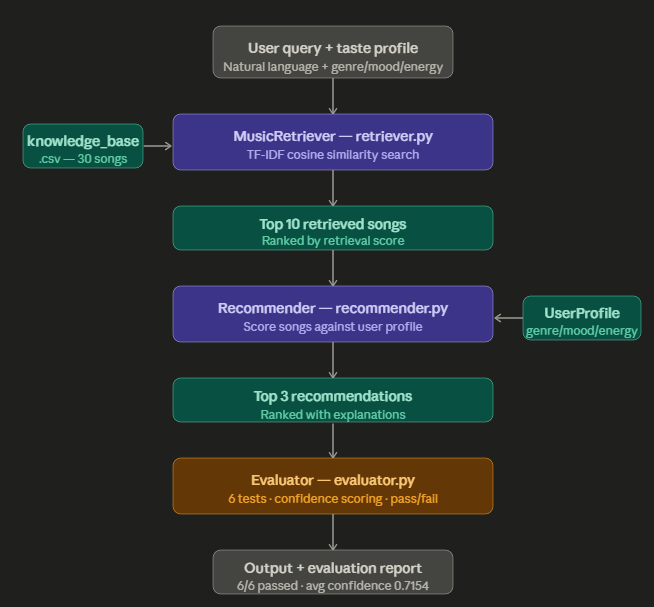

# 🎵 Music Recommender RAG

A Retrieval-Augmented Generation (RAG) system that recommends music based on
natural language queries and user taste profiles. Built on top of the Module 3
Music Recommender Simulation, this system extends the original content-based
scoring engine with a TF-IDF retrieval layer that searches a 30-song knowledge
base before generating personalized recommendations.

## 📹 Demo Walkthrough
<!-- Add your Loom video link here after recording -->
_Loom video coming soon_

---

## 🧠 Base Project
**Original Project:** Module 3 — Music Recommender Simulation
([github.com/summer-waves/ai110-module3show-musicrecommendersimulation-starter](https://github.com/summer-waves/ai110-module3show-musicrecommendersimulation-starter))

The original system loaded a static 10-song CSV catalog, scored each song
against a hardcoded user profile using genre, mood, energy, and acousticness
weights, and returned a ranked list with explanations. It had no retrieval
layer — every song was scored every time regardless of the user's query.

---

## 🏗️ Architecture Overview
```
User Query (natural language)
↓
[ MusicRetriever — retriever.py ]
TF-IDF vectorizer searches knowledge_base.csv
Returns top 10 most relevant songs by cosine similarity
↓
[ Recommender — recommender.py ]
Converts retrieved songs into Song objects
Scores each against UserProfile (genre, mood, energy, acousticness)
Returns top k ranked recommendations with explanations
↓
[ Evaluator — evaluator.py ]
Runs 6 predefined test profiles
Reports pass/fail + confidence score per test
↓
Output: Ranked recommendations with reasoning

```
---

## ⚙️ Setup Instructions

### 1. Clone the repo
```bash
git clone https://github.com/summer-waves/music-recommender-rag.git
cd music-recommender-rag
```

### 2. Install dependencies
```bash
pip install -r requirements.txt
```

### 3. Run the recommender
```bash
python -m src.main
```

### 4. Run the evaluator
```bash
python -m src.evaluator
```

### 5. Run all tests
```bash
python -m pytest -v
```

---

## 💬 Sample Interactions

### Query 1 — Happy Pop Fan
**Input:** Query: "upbeat happy pop songs for dancing and summer vibes"
Profile: pop | happy | energy 0.8
**Output:**
🔍 Retrieved 10 songs from knowledge base:

Sunrise City by The Dawnbreakers (retrieval score: 0.7039)
Good Days Only by Sunny Side (retrieval score: 0.0986)
Gym Hero by PowerBeat (retrieval score: 0.0942)

🎵 Top 3 Recommendations:

Sunrise City by The Dawnbreakers
Genre: pop | Mood: happy | Energy: 0.85
Why: genre match (+2.0) | mood match (+1.0) | energy similarity (+1.43)
Neon Lights by Synthwave Collective
Genre: pop | Mood: happy | Energy: 0.75
Why: genre match (+2.0) | mood match (+1.0) | energy similarity (+1.42)
Good Days Only by Sunny Side
Genre: pop | Mood: happy | Energy: 0.7
Why: genre match (+2.0) | mood match (+1.0) | energy similarity (+1.35)

### Query 2 — Chill Acoustic Listener
**Input:** 
Query: "peaceful acoustic chill music for studying and relaxing"
Profile: acoustic | chill | energy 0.2

**Output:**
🔍 Retrieved 10 songs from knowledge base:

Forest Walk by Nature Beats (retrieval score: 0.2496)
Rainy Afternoon by Cloud Nine (retrieval score: 0.1946)

🎵 Top 3 Recommendations:

Forest Walk by Nature Beats
Genre: acoustic | Mood: chill | Energy: 0.3
Why: genre match (+2.0) | mood match (+1.0) | energy similarity (+1.35) | acoustic match (+0.5)
Porch Swing by Southern Roots
Genre: acoustic | Mood: chill | Energy: 0.3
Why: genre match (+2.0) | mood match (+1.0) | energy similarity (+1.35) | acoustic match (+0.5)
Heartstrings by Melody Lane
Genre: acoustic | Mood: sad | Energy: 0.25
Why: genre match (+2.0) | energy similarity (+1.42) | acoustic match (+0.5)

### Query 3 — High Energy Rock Fan
**Input:** Query: "intense high energy rock with heavy guitars and drums"
Profile: rock | intense | energy 0.95

**Output:**
🔍 Retrieved 10 songs from knowledge base:

Storm Runner by Voltage (retrieval score: 0.5502)
Gym Hero by PowerBeat (retrieval score: 0.2191)

🎵 Top 3 Recommendations:

Storm Runner by Voltage
Genre: rock | Mood: intense | Energy: 0.95
Why: genre match (+2.0) | mood match (+1.0) | energy similarity (+1.50)
Thunder March by Iron Pulse
Genre: rock | Mood: intense | Energy: 0.9
Why: genre match (+2.0) | mood match (+1.0) | energy similarity (+1.43)
Stone Cold by Granite Wave
Genre: rock | Mood: intense | Energy: 0.85
Why: genre match (+2.0) | mood match (+1.0) | energy similarity (+1.35)

---

## 🔧 Design Decisions

**Why TF-IDF for retrieval?**
TF-IDF cosine similarity is fast, requires no API key, and works well on
short descriptive text like song descriptions. It directly satisfies the RAG
requirement without introducing external dependencies.

**Why extend Module 3 specifically?**
The original recommender already had a clean scoring engine. Adding a
retrieval layer on top was a natural evolution — the retriever narrows the
candidate pool first, then the scorer ranks what remains.

**Why a 30-song knowledge base?**
The original catalog had only 10 songs, which caused results to repeat across
very different profiles. Expanding to 30 songs across 6 genres gives the
retriever enough variety to find meaningfully different results per query.

**Trade-offs:**
- TF-IDF only matches on keywords — it won't understand synonyms or context
the way a neural embedding model would. A future version could use
sentence-transformers for richer semantic search.
- Genre weight (+2.0) still dominates scoring. A future version could make
weights configurable per user.

---

## 🧪 Testing Summary

### Evaluator Results
6/6 tests passed
Average confidence score: 0.7154

Every profile returned the correct genre and mood in the top recommendation.
Confidence scores ranged from 0.68 to 0.73, indicating consistent retrieval
quality across all genres.

### Pytest Results
8/8 tests passed in 1.44s

Tests cover: result count, required fields, score range validation,
score ordering, profile-based retrieval, and edge case (vague query).

**What worked:** TF-IDF retrieval was highly accurate for genre-specific
queries with descriptive language. The pipeline from retrieval to scoring
to explanation worked cleanly end-to-end.

**What didn't:** Vague or cross-genre queries sometimes retrieved songs from
unexpected genres, though the scorer still ranked the correct genre first
due to the +2.0 genre weight.

---

## 💭 Reflection

Building this RAG system showed how much retrieval quality shapes the final
output. When the retriever finds the wrong songs, even a perfect scorer
cannot fix it — garbage in, garbage out. The TF-IDF approach works well
for keyword-rich queries but struggles with abstract requests like "something
to cry to" because it has no semantic understanding. This project also
reinforced that transparency matters: showing retrieval scores and scoring
reasons makes the system far more trustworthy than a black-box ranked list.

---

## 📁 Project Structure
music-recommender-rag/
├── data/
│   ├── songs.csv                # Original 10-song catalog (Module 3)
│   └── knowledge_base.csv       # Expanded 30-song RAG knowledge base
├── src/
│   ├── main.py                  # Entry point — runs 3 profile demos
│   ├── recommender.py           # Original scoring engine (Module 3)
│   ├── retriever.py             # RAG retrieval engine (TF-IDF)
│   └── evaluator.py             # Reliability testing + confidence scoring
├── tests/
│   ├── test_recommender.py      # Original tests (Module 3)
│   └── test_retriever.py        # RAG retrieval tests
├── assets/
│   └── architecture.png         # System architecture diagram
├── README.md
├── model_card.md
└── requirements.txt

---

## 🛠️ Built With
- Python 3.11
- scikit-learn (TF-IDF + cosine similarity)
- pandas
- pytest
